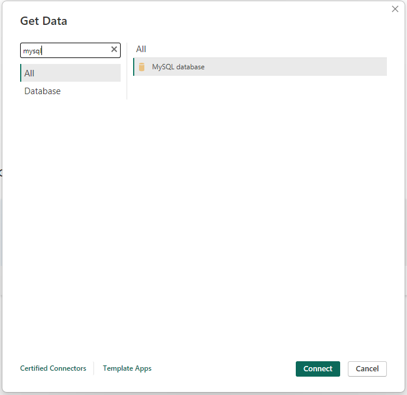
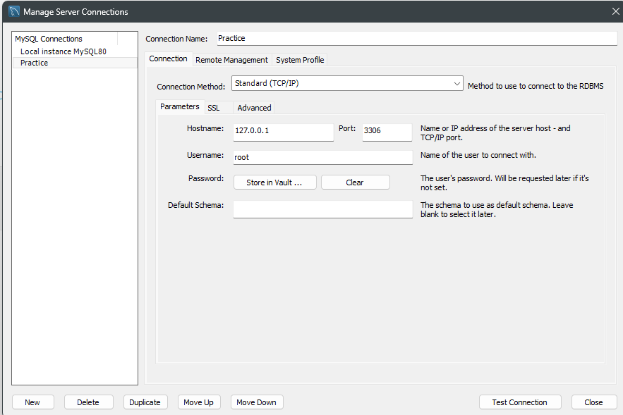
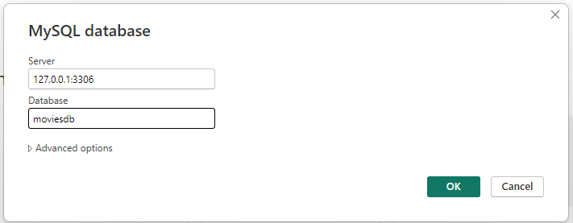
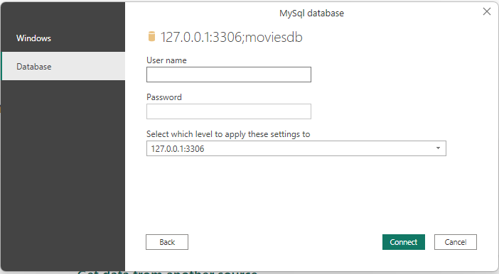
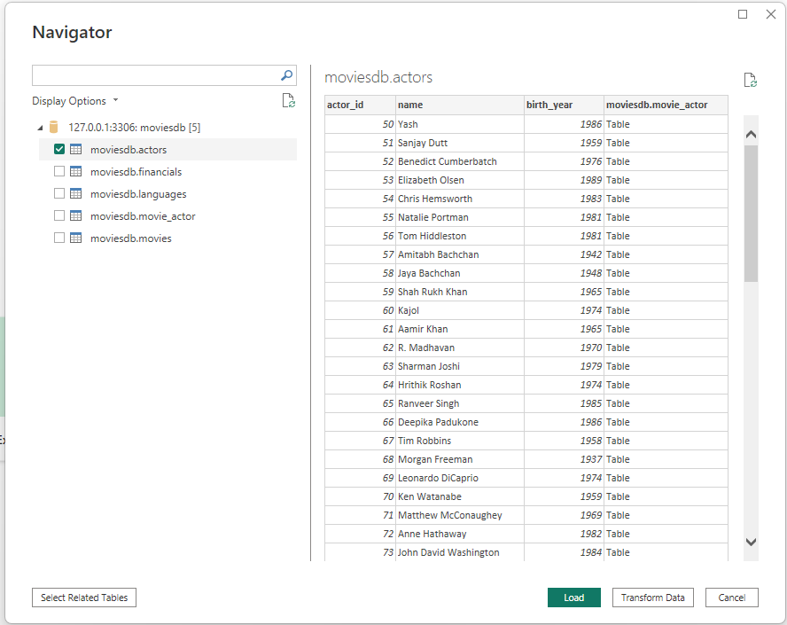
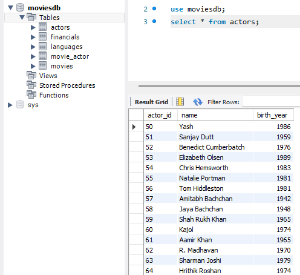

[📌 Click Here to View Documentation](https://aravaravind.github.io/PowerBI-MySQL-Connection/)
# PowerBI-MySQL-Connection

Power BI MySQL Connection – A step-by-step guide on connecting Power BI to a MySQL database. 🚀

## Prerequisites  

- MySQL Server installed  
- Power BI installed  
- MySQL Connector for Power BI installed ([Download Here](https://dev.mysql.com/downloads/connector/net/))  

## Steps for Power BI  

1. Open **Power BI Desktop**
  
2. Click on **Get Data from other sources**, then select **MySQL Database**, and click **Connect**  
   
     

3. Enter server details:  
   - Server is typically **localhost:port number**  
   - In this example, it's `127.0.0.1:3306`  
   - Database name: `moviesdb`  
   
   

     

4. Click **OK**, then select **Database** authentication  

5. Enter your MySQL **username** and **password**, then click **Connect**  

     

6. Done! Your MySQL database is now connected to Power BI  

   

   

## Notes  
- Ensure that **MySQL Server** is running before connecting  
- Use the correct **MySQL Connector** version for compatibility  
- If you encounter issues, check firewall settings and MySQL configuration  

## Author  
[Aravind R](https://linkedin.com/in/arav-r)  

